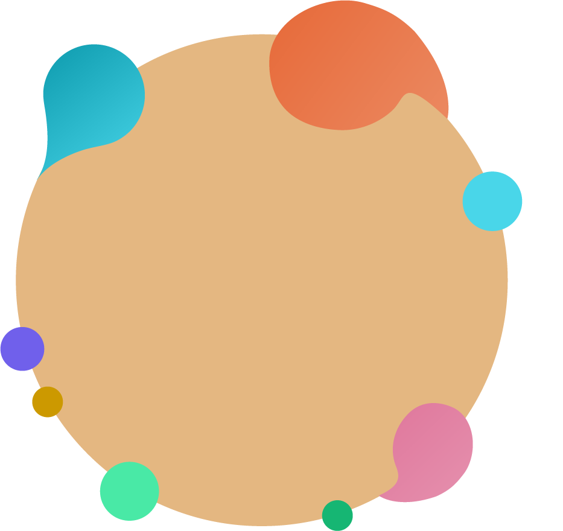

# Noctis IDE Themes

<p align="center"></p>

Unofficial IntelliJ Platform port of [Noctis](https://github.com/liviuschera/noctis) by Liviu Schera — a collection of light and dark themes with a well-balanced blend of warm and cold **medium contrast** colors.

Plugin ID: `com.manvendrask.noctis.jetbrains`  
Display name: **Noctis IDE Themes** (Marketplace rejects titles that contain the word “JetBrains”).  
Compatible with **WebStorm, IntelliJ IDEA, PyCharm**, and other IntelliJ-based IDEs **2025.3+**.

This is a stand-alone theme plugin. It is not affiliated with the original VS Code extension.

## Themes

Each of the 11 upstream palettes is registered twice:

| Islands (2025.3 look) | Classic (pre-Islands chrome) |
| --- | --- |
| Noctis | Noctis Classic |
| Noctis Azureus | Noctis Azureus Classic |
| Noctis Bordo | Noctis Bordo Classic |
| Noctis Obscuro | Noctis Obscuro Classic |
| Noctis Sereno | Noctis Sereno Classic |
| Noctis Uva | Noctis Uva Classic |
| Noctis Viola | Noctis Viola Classic |
| Noctis Minimus | Noctis Minimus Classic |
| Noctis Lux | Noctis Lux Classic |
| Noctis Hibernus | Noctis Hibernus Classic |
| Noctis Lilac | Noctis Lilac Classic |

Islands variants inherit `Islands Dark` / `Islands Light`. Classic variants inherit `ExperimentalDark` / `ExperimentalLight`.

## Requirements

- JDK 21+
- Node.js 18+ (only to regenerate theme files)
- Gradle 9.3.1 (wrapper included)

## Build and try in WebStorm

```bash
./gradlew buildPlugin
```

The installable ZIP lands in `build/distributions/`. In WebStorm:

1. **Settings → Plugins → gear → Install Plugin from Disk…**
2. Choose the ZIP
3. Restart when prompted
4. **Settings → Appearance & Behavior → Appearance → Theme** and pick a Noctis variant

The editor color scheme is wired through each theme’s `editorScheme`, so syntax colors switch with the UI theme.

### Sandbox WebStorm (fast iterate)

```bash
./gradlew runIde
```

This downloads a WebStorm 2025.3 sandbox and launches it with the plugin loaded. Sign in with your JetBrains account if the sandbox asks. A second task, `runWebStorm`, is registered the same way.

Open the files under [`samples/`](samples/) (JS, TS, HTML, CSS, JSON, Markdown) to check syntax colors.

### Visual QA checklist

Do this for at least one dark Islands theme (Noctis), one dark Classic theme, one light Islands theme (Lux), and one light Classic theme:

- Editor tabs: active, inactive, dirty
- Project tool window, terminal, Git diff, Find in Files, completion popup
- Settings dialog, notifications, debugger
- Optional: enable Internal Mode (`idea.is.internal=true` in the sandbox VM options) and use **Tools → Internal Actions → UI → UI Inspector / LaF Defaults** for unstyled keys

## Regenerating themes

Palettes are vendored from the sibling [`noctis`](https://github.com/liviuschera/noctis) VS Code repo:

```bash
# If ../noctis is present (this checkout’s sibling):
node tools/extract-palette.mjs

# Always:
node tools/generate.mjs
```

Or `./gradlew vendorPalette generateThemes`. Generated files live in `src/main/resources/themes/` and `src/main/resources/META-INF/plugin.xml`. Do not hand-edit those; change `tools/generate.mjs` or the palette snapshot instead.

## Publishing

See [docs/publishing.md](docs/publishing.md) for JetBrains Marketplace upload, signing, and screenshots.

## License

[MIT](LICENSE). Color palettes © Liviu Schera (Noctis). This JetBrains port © Manvendra Singh.
