## The font used in screenshots is [Victor Mono](https://rubjo.github.io/victor-mono/)

<table>
  <tr>
    <td align="center">
      <strong>Noctis</strong>  
      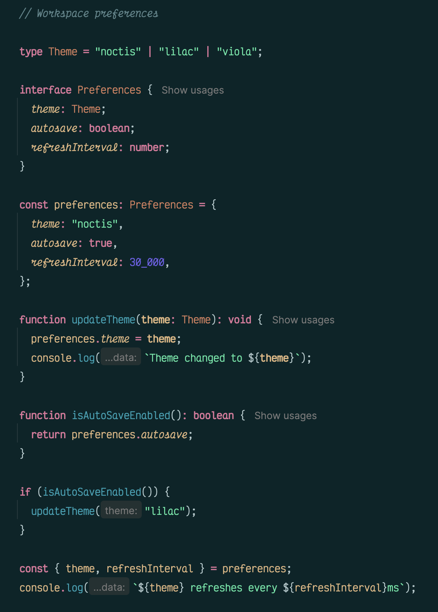
    </td>
    <td align="center">
      <strong>Lilac</strong>  
      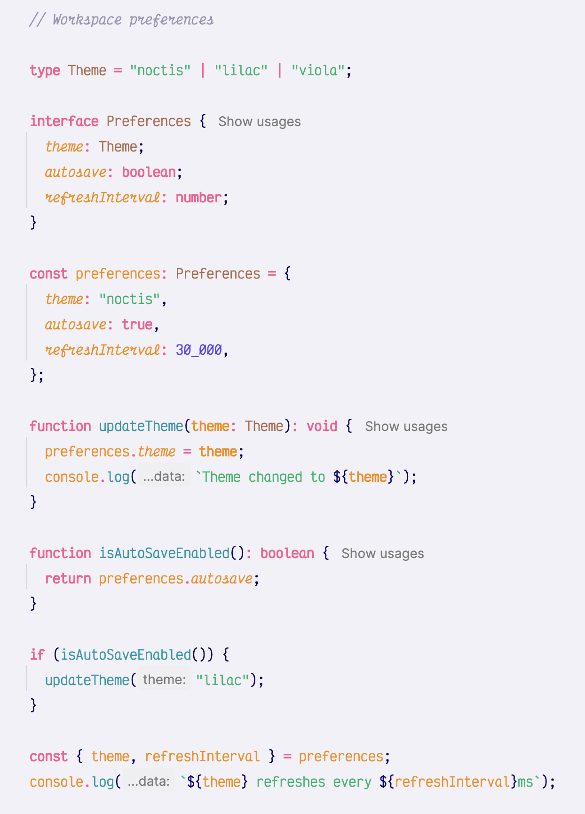
    </td>
    <td align="center">
      <strong>Viola</strong>  
      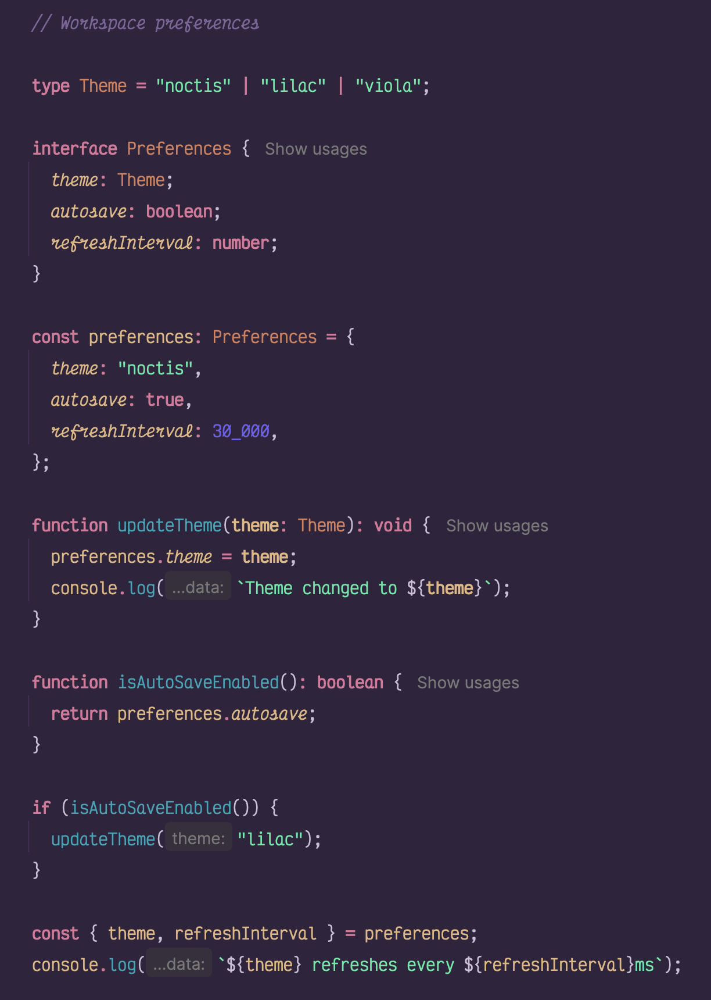
    </td>
  </tr>
  <tr>
    <td align="center">
      <strong>Hibernus</strong>  
      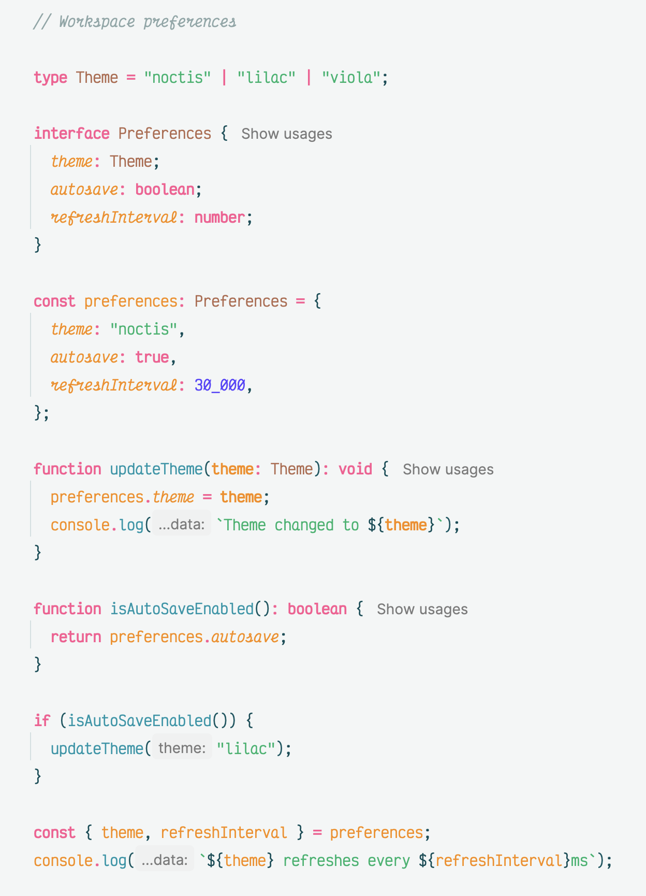
    </td>
    <td align="center">
      <strong>Azureus</strong>  
      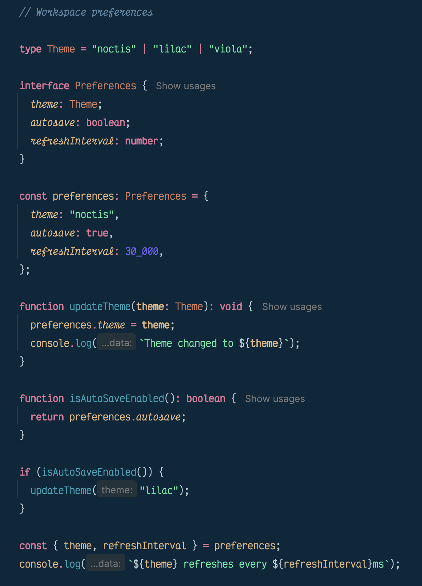
    </td>
    <td align="center">
      <strong>Uva</strong>  
      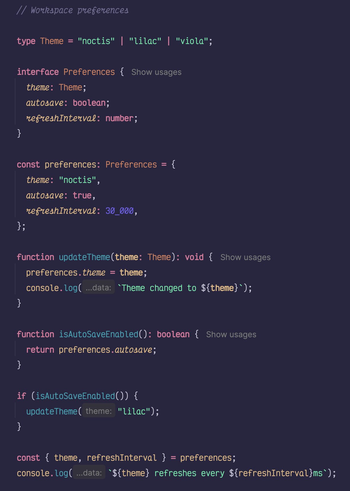
    </td>
  </tr>
  <tr>
    <td align="center">
      <strong>Lux</strong>  
      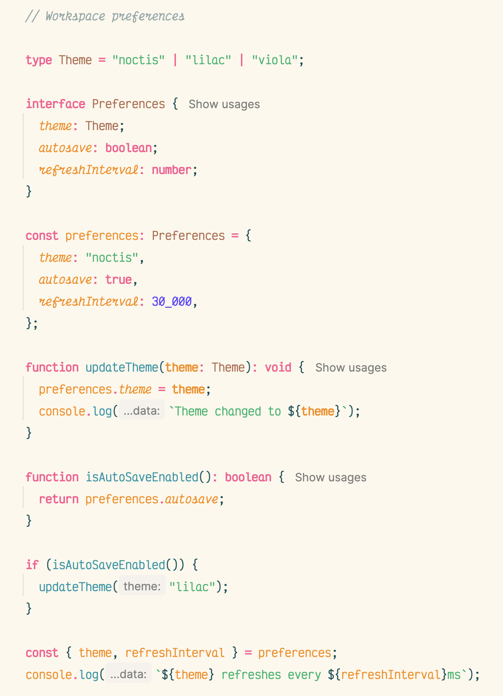
    </td>
    <td align="center">
      <strong>Minimus</strong>  
      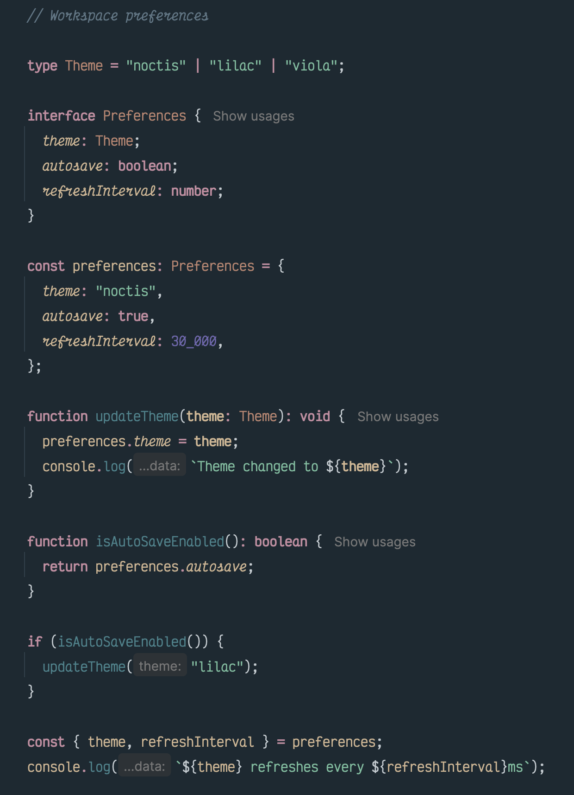
    </td>
    <td align="center">
      <strong>Obscuro</strong>  
      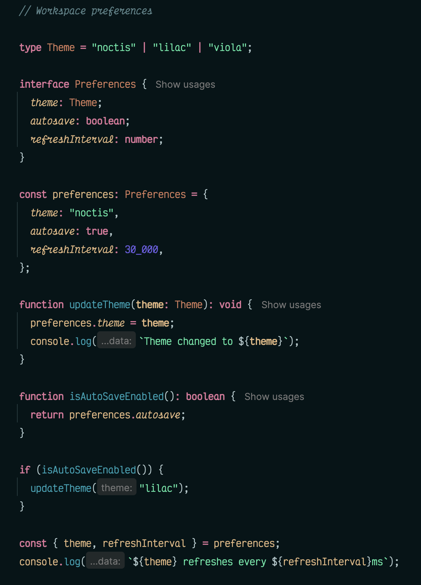
    </td>
  </tr>
  <tr>
    <td align="center">
      <strong>Sereno</strong>  
      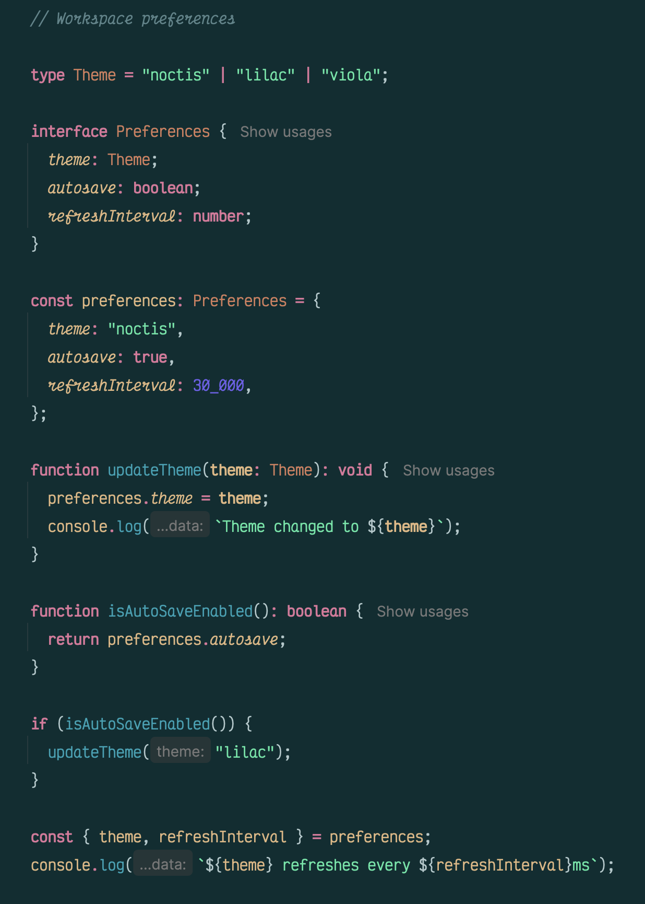
    </td>
    <td align="center">
      <strong>Bordo</strong>  
      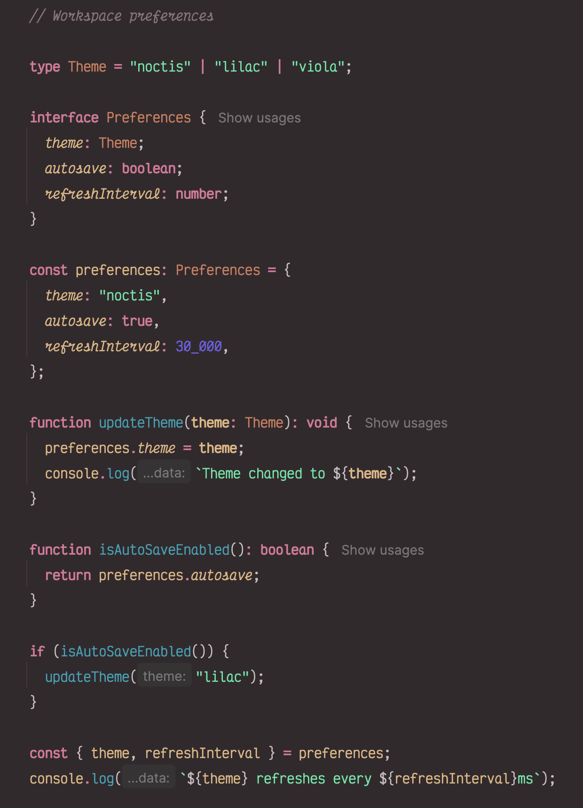
    </td>
    <td></td>
  </tr>
</table>
